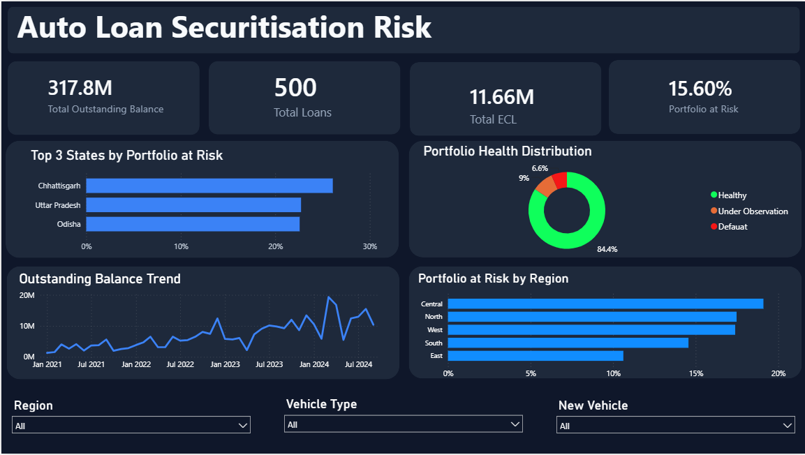
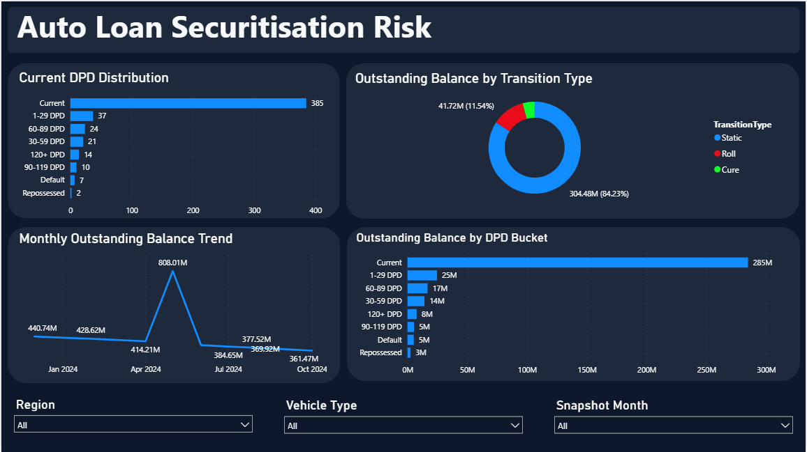

# 🚗 End-to-End Auto Loan Credit Risk Analysis

An end-to-end data analytics project that analyzes an auto loan portfolio using **Python, PostgreSQL, and Power BI**. The project focuses on portfolio performance, expected credit loss (ECL), delinquency trends, and credit risk analysis to support business decision-making.

---

# 📌 Project Overview

Financial institutions continuously monitor loan portfolios to identify credit risk, estimate expected losses, and improve lending decisions.

In this project, I performed:

- Data Cleaning & Exploratory Data Analysis (Python)
- Business-driven SQL Analysis (PostgreSQL)
- Interactive Power BI Dashboard Development
- Business Insight Generation

This project demonstrates a complete end-to-end analytics workflow for evaluating the performance and risk profile of an auto loan securitisation portfolio.

---

# 📂 Dataset

The project uses four datasets representing different components of an auto loan securitisation portfolio.

| Dataset | Description |
|----------|-------------|
| **auto_loan_securitisation_data.xlsx** | Primary loan-level dataset containing borrower information, vehicle details, outstanding balance, IFRS 9 stage, ECL, delinquency, and portfolio attributes. |
| **dpd_snapshot_history.xlsx** | Historical Days Past Due (DPD) snapshots used for delinquency analysis. |
| **dynamic_loss_monthly.xlsx** | Monthly portfolio loss projections and Expected Credit Loss (ECL) related information. |
| **static_pool_vintage_data.xlsx** | Vintage pool performance including cumulative defaults, recoveries, net losses, and remaining pool balance. |

---

# 📊 Dashboard Preview

## Executive Dashboard



---

## Credit Risk Analysis



---

## Loss & Vintage Analysis


---

# 🎯 Business Objectives

The analysis answers the following business questions:

1. What is the total outstanding loan balance of the portfolio?
2. How many active auto loans are currently present in the portfolio?
3. What is the total Expected Credit Loss (ECL)?
4. What percentage of loans are classified as risky (IFRS 9 Stage 2 & Stage 3)?
5. What is the average outstanding balance per active loan?
6. Which vehicle type contributes the highest outstanding balance?
7. Which state has the highest risky loan percentage?
8. How is the outstanding balance distributed across DPD buckets?
9. What is the current delinquency distribution of the portfolio?
10. Which vehicle types contribute the most to portfolio exposure and credit risk?
11. Which combination of Region, Vehicle Type, and Delinquency Status represents the highest overall portfolio risk?
12. Which vintage pools exhibit the highest cumulative net loss rates?
13. Which origination channels generate the highest portfolio credit risk?
14. Which loan servicers manage the riskiest loan portfolios?
15. Which employment segments represent the highest portfolio credit risk?

---

# 🛠️ Tech Stack

- Python
- Pandas
- NumPy
- Matplotlib
- PostgreSQL
- Power BI
- DAX

---

# 📂 Project Structure

```text
end-to-end-auto-loan-risk-analysis
│
├── data
│   ├── auto_loan_securitisation_data.xlsx
│   ├── dpd_snapshot_history.xlsx
│   ├── dynamic_loss_monthly.xlsx
│   └── static_pool_vintage_data.xlsx
│
├── docs
│   ├── business_requirements.md
│   └── business_questions.md
│
├── python
│   └── auto_loan_eda.ipynb
│
├── sql
│   └── business_queries.sql
│
├── powerbi
│   ├── Auto_Loan_Credit_Risk_Dashboard.pbix
│   └── images
│       ├── executive-dashboard.png
│       ├── credit-risk-analysis.png
│       └── loss-vintage-analysis.png
│
└── README.md
```

---

# 🔄 Project Workflow

```text
Raw Data
     │
     ▼
Python Data Cleaning
     │
     ▼
Exploratory Data Analysis (EDA)
     │
     ▼
Business SQL Analysis
     │
     ▼
Power BI Dashboard
     │
     ▼
Business Insights & Decision Support
```

---

# 🐍 Python Analysis

Python was used for:

- Data Loading
- Data Cleaning
- Missing Value Analysis
- Exploratory Data Analysis (EDA)
- Credit Risk Exploration
- Portfolio Visualization

### Exploratory Data Analysis

- IFRS 9 Stage Distribution
- Top 5 States by Outstanding Loan Exposure
- Outstanding Loan Exposure by Vehicle Type
- Distribution of Current Loan-to-Value (LTV)

---

# 🗄️ SQL Business Analysis

Business-driven SQL analysis was performed using PostgreSQL to answer real-world banking questions related to:

- Portfolio Exposure
- Expected Credit Loss (ECL)
- Risky Loan Percentage
- Delinquency Analysis
- Vehicle-wise Portfolio Risk
- State-wise Portfolio Risk
- Vintage Pool Performance
- Origination Channel Risk
- Servicer Performance
- Employment Risk Analysis

---

# 📈 Power BI Dashboard

The interactive dashboard includes:

- Executive Portfolio Overview
- Outstanding Loan Analysis
- Expected Credit Loss (ECL)
- IFRS 9 Stage Distribution
- Delinquency Analysis
- Vehicle-wise Risk Analysis
- Regional Portfolio Analysis
- Vintage Pool Analysis

---

# 💡 Key Business Insights

- Most loans belong to IFRS 9 Stage 1, indicating a generally healthy portfolio.
- SUV loans contribute the highest outstanding loan exposure.
- Credit risk is concentrated within a relatively small portion of Stage 2 and Stage 3 loans.
- Portfolio exposure varies across different states.
- Vintage pool analysis highlights differences in long-term portfolio performance.
- ECL analysis identifies high-risk borrower segments requiring closer monitoring.

---

# 📈 Business Impact

This project demonstrates how financial institutions can:

- Monitor portfolio credit risk.
- Estimate expected future losses.
- Improve underwriting strategies.
- Monitor delinquency trends.
- Prioritize collection efforts.
- Support data-driven lending decisions.

---

# ▶️ How to Run

### Clone Repository

```bash
git clone https://github.com/Sumit2-pixel/end-to-end-auto-loan-risk-analysis.git
```

### Open the project

- `python/auto_loan_eda.ipynb`
- `sql/business_queries.sql`
- `powerbi/Auto_Loan_Credit_Risk_Dashboard.pbix`

---

# 📚 Skills Demonstrated

- Data Cleaning
- Exploratory Data Analysis (EDA)
- Business Analytics
- SQL
- PostgreSQL
- Power BI
- DAX
- Data Visualization
- Credit Risk Analytics
- Business Intelligence

---

# 🚀 Future Improvements

- Loan default prediction using Machine Learning.
- Automated reporting pipeline.
- Real-time portfolio monitoring dashboard.
- Time-series portfolio performance analysis.

---

## 👨‍💻 Author

**Sumit Chauhan**

- GitHub: https://github.com/Sumit2-pixel
- LinkedIn: *(www.linkedin.com/in/sumit-chauhan1)*

---

## ⭐ If you found this project useful, consider giving it a star.
